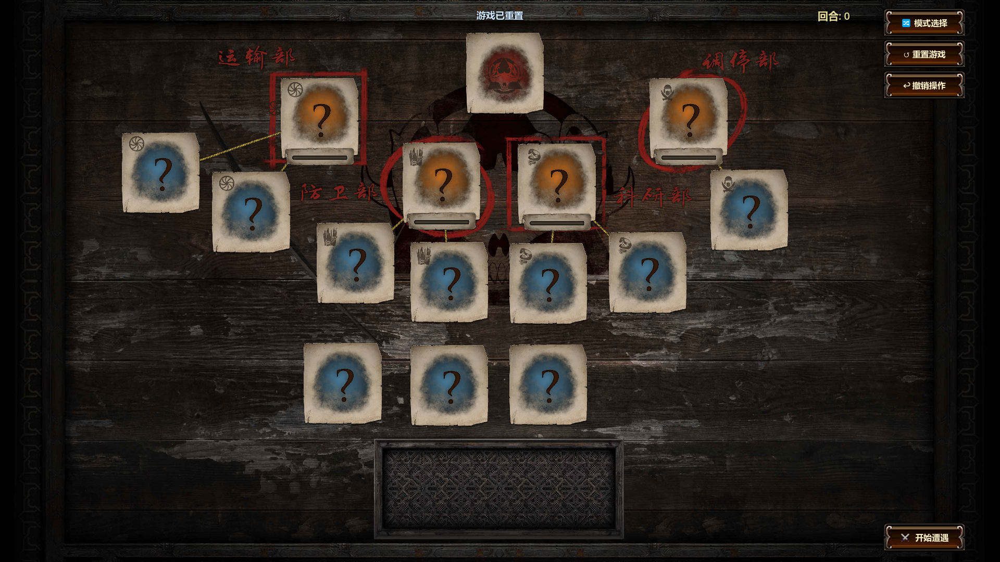
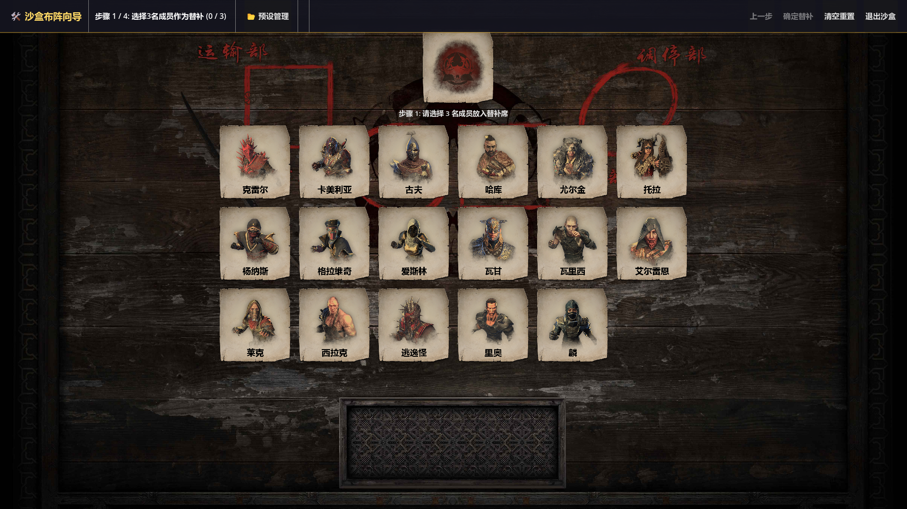
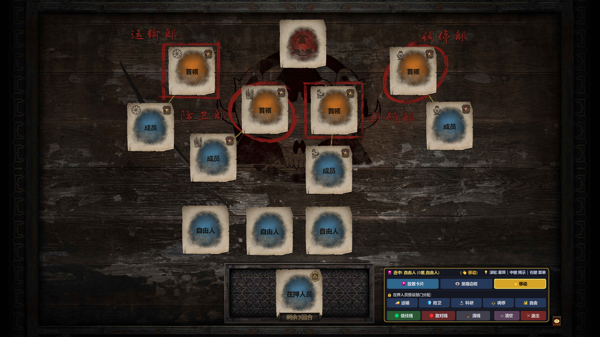

# 🎲 流放之路不朽辛迪加 (Immortals Syndicate) 推演游戏

> 一款流放之路**不朽辛迪加 (Syndicate) 独立解密与推演模拟游戏**。
> 本项目旨在复刻并还原丰富的逻辑推演体验，提供经典对抗、自由沙盒预设、画板连线推演及新手教学等丰富模式。
## ⚠️ 免责与版权声明 (Disclaimer & Fan Content Policy)

> [!IMPORTANT]
> 1. **独立创作**：本项目纯属**个人出于兴趣爱好**独立开发制作的粉丝作品，**与 Grinding Gear Games (GGG) 及其母公司腾讯无任何官方关联、赞助或认可关系**。
> 2. **美术与视觉资产归属**：游戏中所使用的相关素材、图标、概念设计与商标等视觉资产，**其原作者版权与知识产权均归 Grinding Gear Games (GGG) 所有**。

---
---

## 🖼️ 游戏界面预览 (Screenshots)

### ⚔️ 经典遭遇模式 (Classic Mode)
> 真实复刻辛迪加黑帮遭遇战逻辑，支持审讯、释放、背叛与商谈，解锁安全屋锁定藏身处。

 

### 🧪 自由沙盒模式 (Sandbox Mode)
> 自由排布 14 名部门成员与游荡自由人，绘制信任与敌对关系网，支持保存并复原方案预设。

 

### 🎨 交互画板模式 (Whiteboard Mode)
> 17 名成员节点可视化拖拽与自由连线，快捷绘制/擦除红绿关系网，战前直观推演出场概率。

---

## ✨ 核心功能与系统大盘点

### 1. ⚔️ 经典模式（Classic Encounter Mode）
- **黑帮势力轮转引擎**：14 名上阵成员与 3 名替补池轮换，真实复刻人员补充与升降星逻辑；
- **遭遇战队列生成**：研究部与调停部必定出现，运输部与防卫部二选一轮换刷新；
- **2人遭遇智能判定**：卡牌上方根据首领/下属职务、信任绿线、敌对红线智能弹出 **⚔ 处决** 与 **☠ 背叛** 选项；
- **1人遭遇商谈系统**：按星级（3星=8情报、2星=6情报、1星=4情报、0星自由人=2情报）结算，包含结盟、退组、互换职位、化解部门恩怨、毁装备及劫狱等完整逻辑；
- **审讯室与刑期系统**：最多关押 3 名囚犯，每参与一次遭遇战刑期减 1 回合，持续积累部门情报；
- **安全屋与 100% 藏身处突袭**：到达 100% 后触发该部门暂时屏蔽，成功完成 3 次遭遇战后未突袭启动 10% 情报衰减。

### 2. 🧪 自由沙盒预设模式（Sandbox Preset Mode）
- **自定义黑帮盘面排布**：支持自定义四大部门成员、首领人选以及游荡自由人的初始分布；
- **自由人星级与职务锁定**：游荡自由人精准锁定 0 星无部门，支持多星级下属与首领搭配；
- **人际关系网络构建**：可视化绘制并保存成员之间的信任（绿线）与敌对（红线）关系；
- **方案保存与一键复原**：支持本地预设保存与一键恢复盘面，方便反复实验不同布局！

### 3. 🎨 画板模式 / 可视化推演板（Whiteboard Mode）
- **可视化成员画板**：在白板上自由拖拽、摆放 17 名辛迪加成员节点；
- **动态红绿连线工具**：快捷在任意两名成员之间拉出信任绿线或敌对红线，或一键擦除恩怨；
- **全局战术草稿**：方便玩家在战前直观推演关系网对后续遭遇战出场概率的连锁影响！

### 4. 📚 游戏内置百科大全与教程系统
- **嵌入式阅读引擎**：内置完整的新手入门指南，章节目录跳转精准支持 **Top Position（视口最上方顶端对齐）**；
- **内嵌文本零丢失双保险**：兼顾本地开发与打包 `.exe` 独立运行，文件读取失败时自动切换内置文本；

---

## 🛠️ 技术栈与环境依赖

- **游戏引擎**：[Godot Engine 4.x](https://godotengine.org/) (Forward+ / D3D12 渲染器)
- **界面组件**：Vanilla CSS 动态视觉、`MarkdownLabel` Markdown 渲染引擎
- **目标平台**：Windows Desktop (x86_64)

---

## 🚀 如何运行与编译

### 1. 运行项目
1. 下载并安装 [Godot Engine 4.x](https://godotengine.org/download)；
2. 克隆或下载本项目源码至本地文件夹；
3. 打开 Godot 导入本项目根目录下的 `project.godot`；
4. 按 `F5` 键即可启动运行游戏。

### 2. 打包导出二进制 (`.exe`)
1. 打开项目，点击顶部菜单栏 **`项目 (Project)`** -> **`导出 (Export...)`**；
2. 选择 **`Windows Desktop`** 导出预设；
3. 点击 **`导出项目 (Export Project...)`** 即可一键生成独立运行的 `辛迪加.exe`！

---

## 📜 开源协议与署名条款 (License & Attribution)

本项目源代码部分严格采用 **[GNU General Public License v3.0 (GPL-3.0)](LICENSE)** 强自由开源协议。

根据 GPL-3.0 协议规范，任何人均可自由地下载、学习、修改、衍生或分发本项目代码，但**必须遵守以下强制传染与署名条款**：

1. **必须保留原作者署名**：任何二次修改、衍生、分发或包含本项目代码的仓库及作品中，**必须完整保留原作者 (Ka3m) 的版权声明与 GPL-3.0 许可文本**，不得随意移除原作者信息。
2. **强制衍生代码开源**：任何使用、衍生或修改本项目代码而生成的新软件/游戏，**也必须以 GPL-3.0 协议全量开源其源代码**，严禁将其拿去进行二次闭源包装或打包卖钱。
3. **第三方资产免责与非商业化**：本项目仅对独立撰写的 GDScript 代码部分按 GPL-3.0 开源。游戏涉及的所有 Grinding Gear Games (GGG) 第三方美术资产、概念商标与视觉版权仍归原版权方所有，**绝不得将含有第三方资产的衍生软件用于任何形式的商业盈利目的**。

---

## 💬 联系与反馈

如果你对本项目有任何建议或改进想法，欢迎通过以下方式沟通交流：
- **B站**：[@Ka3m](https://space.bilibili.com/99815426)
