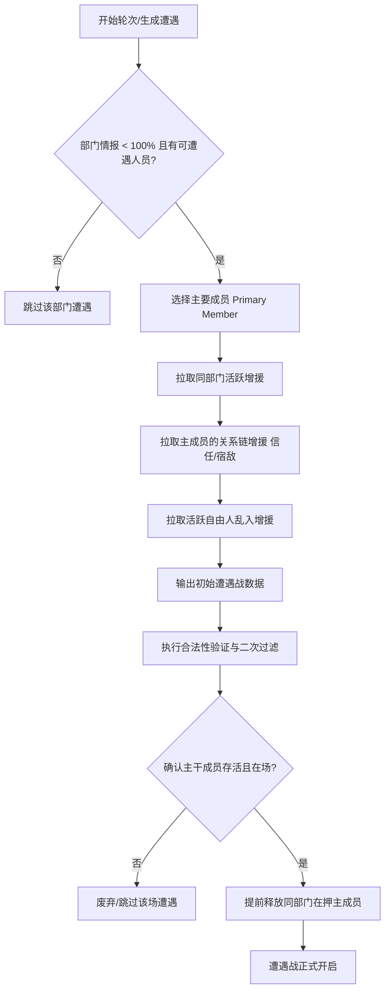

# 不朽成员遭遇战生成与成员选择机制文档

本文档详细说明在辛迪加沙盒与普通模式的单场遭遇战（Encounter）中，主要成员（Primary Member）是如何被确定为锚点的，以及其他增援成员是如何通过各种规则被“带”入战局的。

---

## 一、 整体生成流程概览

遭遇战的生成遵循“**锚点部下 + 动态增援**”模型，单场遭遇战最大人数限制为 **4 人**（`MAX_ENCOUNTER_MEMBERS := 4`）。其生成与验证流程分为以下几个核心阶段：

---

## 二、 主要成员（Primary Member）的选出规则

主要成员是遭遇战的**锚点核心**，通常从该部门的基层部下（非首领）中选出：

1. **优先选择活跃部下**：
   * 必须属于当前部门（`division == div`）；
   * 不能是首领（`not is_leader`）；
   * 必须在场（`is_on_board == true`）；
   * 必须处于自由活跃状态（`not is_imprisoned`）。
   * 满足条件的部下放入候选池，**随机挑选一名**作为主要成员。

2. **兜底选择在押部下（提前释放）**：
   * 如果该部门**没有任何**活跃的基层部下，系统会检索该部门处于**在押审讯中**的下属成员。
   * 如果存在在押下属，随机挑选一名作为主要成员，并在遭遇开启时**提前释放**它（将其降星处罚延迟到战后结算）。
   
3. **跳过遭遇**：
   * 若该部门既无活跃部下，又无在押部下，则**首领绝不单独出场**，直接跳过并取消该部门本次遭遇战。

---

## 三、 增援成员的“带出”逻辑

当主要成员（记为 `primary_name`）确定后，系统将尝试“带出”其他增援成员，直到人数达到 **4 人** 上限。增援的拉取按优先级分为三个梯度：

### 1. 同部门增援（极高概率）
* **候选条件**：与主成员属于同一部门、在场、且未入狱、非首领（如果在场还有未揭示的其他角色，首领不参与普通遭遇）。
* **带出概率**：**85%**（`randf() < 0.85`）。
* **目的**：保证遭遇战具有强烈的部门特征。

### 2. 关系链增援（中等概率）
* **候选条件**：与主成员存在直接**信任（Trust）**或**宿敌（Rivalry）**关系。
* **过滤条件**：
  * 该成员必须在场（`is_on_board == true`）。
  * 🚨 **必须是非在押状态**（`not is_imprisoned`）。**在押审讯人员绝不会因为关系链被带出**。
  * 该成员所属部门的安全屋情报未满 100%（满 100% 安全屋就绪的成员锁定备战，不参与其他遭遇的增援）。
* **带出概率**：**50%**（`randf() < 0.50`）。
* **目的**：引入跨部门的爱恨情仇交互（背叛、信任、处决等动作的基础）。

### 3. 自由人乱入（中等概率）
* **触发条件**：当前遭遇战部门的成员总数未满上限（部门人数小队不满），且遭遇战人数仍有空位。
* **候选条件**：属于游民/自由人（`division == NONE`）、在场且未入狱。
* **带出概率**：**35%**（`randf() < 0.35`）。
* **目的**：给自由人提供乱入遭遇的机会，使玩家可以通过“谈判”将其吸纳进该部门。

---

## 四、 遭遇战验证与二次过滤（Validation）

在遭遇战入队列及玩家点击处理前，为防止在上一个遭遇战中因玩家的选择（如处决、关押、升职）改变了成员状态，必须经过一次**二次过滤校验**：

1. **基础过滤**：
   * 过滤掉已经入狱的成员（本部门作为主干被释放的在押下属除外）；
   * 过滤掉退场、不在盘面上的成员；
   * 过滤掉其所属部门安全屋已就绪被锁定的成员。
   
2. **重新确立主干锚点**：
   * 在过滤后剩余的存活参战成员中，寻找属于遭遇战本部门的成员。
   * 将找到的第一个成员重新确立为**主干成员**。
   * **若没有找到任何同部门的存活下属作为主干，此场遭遇战直接作废/跳过**。

3. **跨部门增援的“关系”二次校验**：
   * 对于所有非本部门、非自由人的跨部门增援候选人，检验其与确立的**新主干成员**之间是否依然存在信任或宿敌关系。
   * **若关系在前面的处理中已被清除或改变，与新主干无任何关系，则该增援被强制剔除出本场遭遇**。

---

## 五、 特殊机制：在押主干提前释放

如果通过上述第二条中的兜底规则，将一个在押下属选为了主要成员：
* 系统在将该遭遇战从队列中取出并激活时，会触发 `_check_and_release_imprisoned_subordinates_for_encounter()`。
* 该成员会**被提前释放**，恢复在场（`is_imprisoned = false`），并标记 `has_pending_prison_penalty = true`（延迟扣星）。
* 这样确保遭遇战开始时，他能以活跃状态呈现在玩家的卡片面板中，供玩家在遭遇中对其进行新的处决、背叛或结盟处理。
